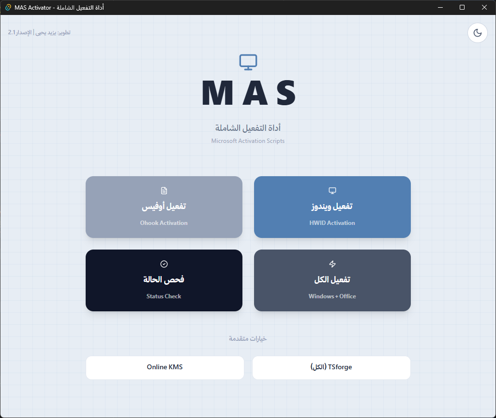

<div dir="rtl">

<div align="center">

# 🖥️ MAS Activator
### أداة التفعيل الشاملة لـ Windows و Office

[](https://github.com/SMSMy/mas-activator-Disktop/releases)
[](https://github.com/SMSMy/mas-activator-Disktop/releases)
[](https://tauri.app)
[](https://www.rust-lang.org)

<br/>



</div>

---

## 📋 وصف البرنامج

**MAS Activator** هو تطبيق سطح مكتب مبني بتقنية **Tauri + Rust** يوفر واجهة عربية احترافية لتفعيل منتجات Microsoft باستخدام نصوص [Microsoft Activation Scripts (MAS)](https://massgrave.dev) الرسمية.

البرنامج يتواصل مع النظام مباشرةً وينفذ عمليات التفعيل الحقيقية — ليس مجرد واجهة بل أداة تشخيص وتفعيل فعّالة.

---

## ✨ المميزات

| الميزة | التفاصيل |
|--------|----------|
| 🪟 **تفعيل ويندوز** | عبر HWID — تفعيل دائم لا يحتاج اتصال |
| 📄 **تفعيل أوفيس** | عبر Ohook — يدعم Office 2016/2019/2021/365 |
| ⚡ **تفعيل الكل** | ويندوز وأوفيس بضغطة واحدة |
| 🔍 **فحص الحالة** | تشخيص دقيق لحالة ترخيص النظام |
| 🛡️ **TSforge** | تفعيل متقدم يدعم Windows ESU وإصدارات Server |
| 🌐 **Online KMS** | تفعيل KMS — يتجدد تلقائياً كل 180 يوم |
| 🔄 **تحديث تلقائي** | يتحقق من التحديثات عند التشغيل ويحمّلها مباشرة |
| 🌙 **وضع ليلي/نهاري** | دعم كامل للثيمين |
| 📋 **سجل تنفيذ** | عرض مباشر لمخرجات العمليات |

---

## 📸 لقطات الشاشة

<div align="center">

### الواجهة الرئيسية


### فحص حالة التفعيل


</div>

---

## 🚀 التثبيت والتشغيل

### الطريقة السريعة (موصى بها)
1. حمّل آخر إصدار من [صفحة الإصدارات](https://github.com/SMSMy/mas-activator-Disktop/releases)
2. شغّل الملف `MAS.Activator_x.x.x.Portable.exe`
3. قبل التشغيل، انقر بالزر الأيمن ← **تشغيل كمسؤول**

> ⚠️ **مهم:** يتطلب البرنامج صلاحيات المسؤول لتنفيذ عمليات التفعيل

---

## 🔧 طرق التفعيل المتاحة

### 🪟 تفعيل ويندوز — HWID
التفعيل الرقمي المرتبط بعتاد الجهاز. **دائم** ولا يحتاج اتصالاً بعد التفعيل.
- يدعم: Windows 10 / 11 جميع الإصدارات

### 📄 تفعيل أوفيس — Ohook
يثبت hook على خدمة ترخيص Office. **دائم** ويعمل بدون اتصال.
- يدعم: Office 2016, 2019, 2021, 2024, 365

### 🛡️ TSforge
طريقة متقدمة تدعم:
- Windows 10/11 ESU (التحديثات الممتدة)
- إصدارات Windows Server
- Office بجميع إصداراته

### 🌐 Online KMS
- يحتاج اتصالاً بالإنترنت
- التفعيل يستمر 180 يوماً ويتجدد تلقائياً

---

## 🔍 فحص الحالة

يعرض البرنامج تقريراً دقيقاً يشمل:

| الكود | المعنى |
|-------|--------|
| ✅ مفعل | الترخيص صالح ونشط |
| ⚠️ إشعار ترخيص | يحتاج مراجعة (Notification) |
| ⏳ فترة سماح | ضمن مهلة Grace Period |
| ❌ غير مرخص | يحتاج تفعيلاً |
| ❌ نسخة غير أصلية | اكتُشف انتهاك للترخيص |

---

## 🏗️ التقنيات المستخدمة

```
Frontend:  React 19 + TypeScript + Tailwind CSS + Framer Motion
Backend:   Rust (Tauri 2.x)
Build:     Vite 7 + pnpm
Language:  Arabic (RTL) واجهة عربية بالكامل
```

---

## 🔄 نظام التحديث التلقائي

عند تشغيل البرنامج، يتحقق تلقائياً من وجود تحديث جديد على GitHub.  
إذا توفّر تحديث، تظهر نافذة تعرض التغييرات مع زر تحميل مباشر.

---

## ⚠️ إخلاء المسؤولية

هذا البرنامج تعليمي وأكاديمي. يستخدم نصوص [MAS](https://massgrave.dev) مفتوحة المصدر.  
المستخدم مسؤول عن الالتزام بشروط ترخيص Microsoft في بلده.

---

## 👨‍💻 التطوير

**المطوّر:** يزيد يحيى  
**المستودع:** [github.com/SMSMy/mas-activator-Disktop](https://github.com/SMSMy/mas-activator-Disktop)  
**الترخيص:** MIT

</div>
